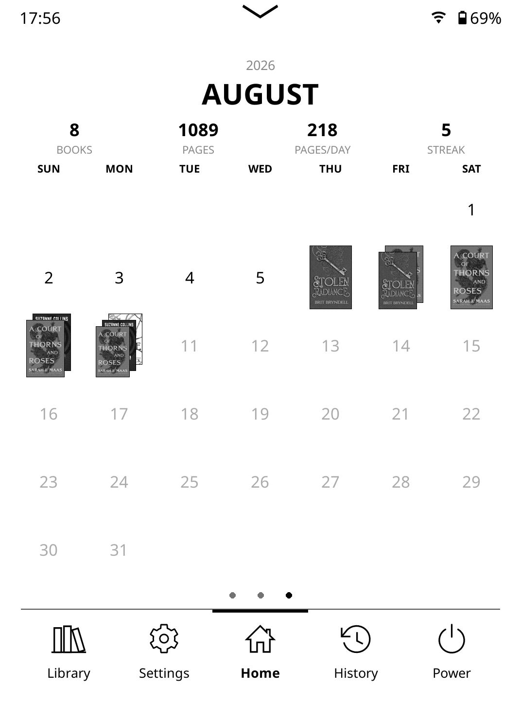
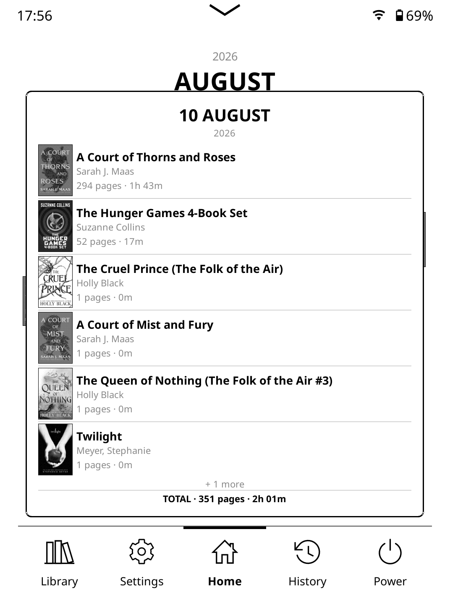

# Reading Calendar — SimpleUI homescreen module for KOReader

A month-view calendar for the [SimpleUI](https://github.com/doctorhetfield-cmd/simpleui.koplugin)
homescreen. Every day you read shows the **cover(s) of the book(s) you read
that day** — when you read multiple books in one day, the covers **stack**
with a small fanned offset. Days without reading show a plain day number.
Tap a day to see that day's books — covers, authors, pages and time — and
tap a book to open it. The calendar automatically sizes itself to fit your
screen.

<p align="center">
  
  &nbsp;
  
</p>

## Stats strip

The header shows month stats in configurable columns (long-press the
module → **Statistics** and toggle any combination):

| Stat | Meaning |
| --- | --- |
| **BOOKS** | Distinct books read this month |
| **PAGES** | Total pages read this month |
| **PAGES/DAY** | Pages divided by the number of days you actually read |
| **TIME** | Total reading time this month |
| **TIME/DAY** | Reading time divided by days you actually read |
| **DAYS** | Number of days you read this month |
| **STREAK** | Current consecutive-day reading streak (not month-bound; a day with no pages yet doesn't break it until midnight) |

The default is BOOKS · PAGES · PAGES/DAY. Columns re-space automatically
for however many stats you enable.

All data comes from KOReader's built-in statistics database — nothing extra
to track. Covers come from SimpleUI's cover cache.

## Install

You need the SimpleUI plugin installed. Then pick **one** of these:

### Option A — you have [simpleui_ext](https://github.com/omer-faruq/simpleui_ext.koplugin)

Copy `module_reading_calendar.lua` into:

```
koreader/plugins/simpleui_ext.koplugin/modules/
```

Restart KOReader. It is auto-registered.

### Option B — SimpleUI only (no simpleui_ext)

Copy the whole `readingcalendar.koplugin/` folder into:

```
koreader/plugins/
```

Restart KOReader.

### Add it to your homescreen

Installing registers the module with SimpleUI but does **not** place it —
you choose where it goes:

1. Open SimpleUI's settings menu.
2. Go to **Modules → Edit Layout**.
3. Swipe to the page where you want the calendar (a page of its own works
   best — the calendar sizes itself to fill the visible area).
4. Tap **Add Module** and pick **Reading Calendar**.

You can move or remove it later from the same layout editor. If your
homescreen still uses the default layout (you never customized it), the
module may simply appear at the end without this step.

The calendar automatically fits your screen: day cells use book-cover
proportions when there is room and shrink so the whole month always fits
the visible area, whatever the device or orientation.

## Interactions

| Gesture | Action |
| --- | --- |
| Swipe left / right on the calendar | Next / previous month |
| Tap left / right side of the header | Previous / next month |
| Tap the month name | Jump back to the current month |
| Tap a day with covers | Day popup: covers, titles, pages and time per book |
| Tap a book in the day popup | Open that book |

You cannot navigate past the current month.

## Settings

Long-press the module (SimpleUI module menu):

- **Statistics** — pick which stat columns show in the header strip.
- **Start week on Monday** — default is Sunday-first, like the screenshot.
- **Scale** — standard SimpleUI module scaling.

Up to 3 covers stack per day (the most-read book is on top).

## How covers are found

The statistics database stores a checksum per book, not a file path. The
module resolves checksums to files by scanning your reading history's
sidecar metadata once, then caches the mapping persistently
(`reading_calendar_map.lua` in the KOReader data folder). Books whose file
has been deleted or removed from history fall back to a mini title-card
placeholder. Covers extracted in the background pop in automatically.
